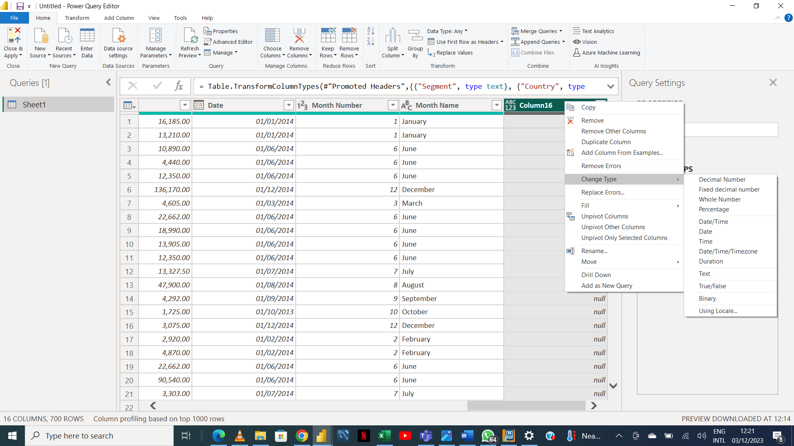
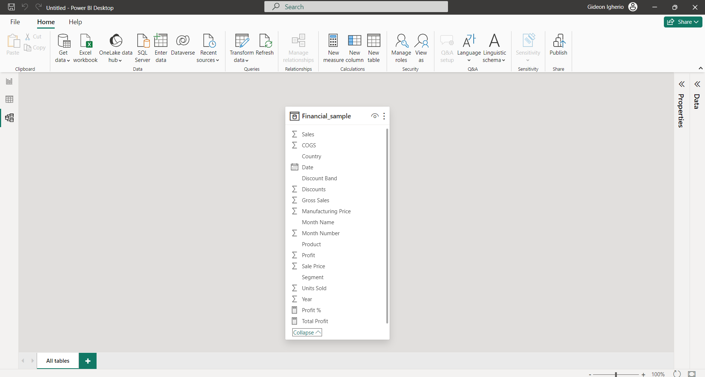
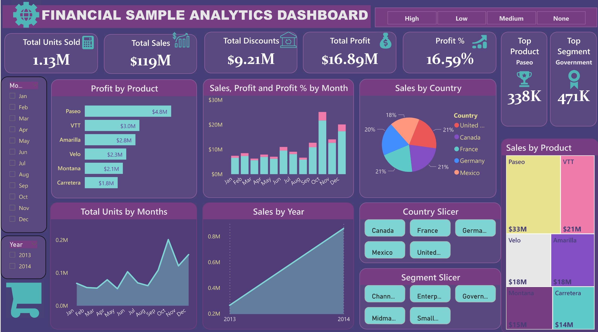

## Financial Sample Analysis

-----
### Introduction
This project focuses on analyzing the financial sales trend of some products across different segments of various countries in Europe, North America, and Central America. The analysis will aid us in deriving actionable insights and help us in answering crucial questions about the spread of the products across 3 continents as stated above, and the reason for the popularity and acceptability of one product over the other.
The project uses Power BI as a business intelligence tool.

Power BI Concepts applied:
- DAX Concepts
- Calculated Columns, etc.

**_Disclaimer_**: Dataset used does not belong to any company, and the report derived from this project only seeks to demonstrate @Raregideon’s capabilities as a Data Analyst. The project is and dataset were provided in the #30DaysOfLearning, powered by @Microsoft, and championed by @Oyinbbooke

----
### Problem Statement

1.	Which product has the maximum aggregate sales volume?
2.	For each country, identify the product with the maximum aggregate sales volume.
3.	Identify the country with the maximum aggregate sales volume and elucidate the contributing factors.
4.	In which market segment was the maximum aggregate sales volume observed and what were the contributing factors?
5.	Identify the product with the maximum aggregate sales volume in each market segment.
6.	During which month of the fiscal year was the maximum aggregate sales volume recorded and what were the contributing factors?
7.	In which fiscal year was the aggregate sales volume the highest?
8.	What variables influenced the sales volume of products across different countries?
9.	What variables contributed to the low sales volume of the least sold product?

----
### Data Sourcing
Following the creation of the aforementioned queries, the data was subsequently downloaded in the form of an Excel file. This data was then imported into Power BI, where it underwent a process of cleansing, analysis, and visualization.
It contains 15 columns ranging from Segment, Country, Sales, Date, etc.

----
### Data Transformation
Data was efficiently cleaned and transformed using the Power Query Editor of Power BI. Some of the steps applied include, but not limited to:
- Promotion of headers
- Creation of new columns
- Extraction of first 3 characters
- Removal of duplicates
- Filtration of rows, etc.

Data Transformation Process
:--------------------:

------
### Data Modelling:
No modeling connection was established, as the dataset contains just one table with 15 columns and 700 rows.

Modeling
:----------:

----
### Data Analysis and Visuals

From the Dashboard, we can decipher the following:
-	A cumulative total of 1.13 million units across all product lines generated approximately $119 million in sales.
-	The aggregate profit for the fiscal years 2013 and 2014 amounted to $16.89 million.
-	During this timeframe, discounts totaling $9.21 million were extended to customers across various segments.
-	The product "Paseo" emerged as the top performer in terms of both sales and profit, achieving sales of approximately 33 million units and generating $4.8 million in profit across diverse countries and segments.
-	The peak aggregate sales volume was observed in October for both 2013 and 2014, reaching a total of about 201,000 units. In contrast, March experienced significantly lower sales, with only about 53,000 units sold. The extent of discounts offered to customers in all segments played a significant role in influencing these trends.
-	It was observed that the Enterprise segment contributed negatively to the overall profit, with a percentage profit of 3.04% contribution. This may be that, aside from the discounts, the sales of retail products were given to the Enterprisers as loans which are yet to be returned or remitted, hence, no profits are yet to be declared.

----
### Recommendations:
The Management Team of this company is advised to do the following, based on the analysis above:
-	Evaluate and adjust the discount strategy during peak months like October to maximize sales without compromising profit.
-	Tailor marketing efforts to customer segments that received the most discounts, ensuring targeted promotions for higher sales.
-	Focus on improving or promoting products with lower sales and profit. Consider discontinuing underperforming products. This is part of Product portfolio optimization.
-	Identify opportunities for market expansion, particularly in regions or segments with lower sales. Develop strategies to address specific issues affecting sales.
-	Review and adjust inventory levels to meet peak demand during critical months while avoiding excess stock during slower periods.
-	Implement a continuous monitoring system for sales data to quickly adapt strategies based on market trends, ensuring proactive responsiveness.
-	Implement or improve CRM systems to gain insights into customer behaviour. Utilize this information for personalized marketing and loyalty programs.
-	Allocate resources to further develop the successful "Paseo" product line, exploring variations or extensions to capitalize on its popularity.
-	Strive for a balanced approach between discounts and profitability, aligning the discounting strategy with overall financial goals.
-	Conduct benchmarking and competitive analysis to identify areas for improvement or differentiation, ensuring a competitive edge in the market.

